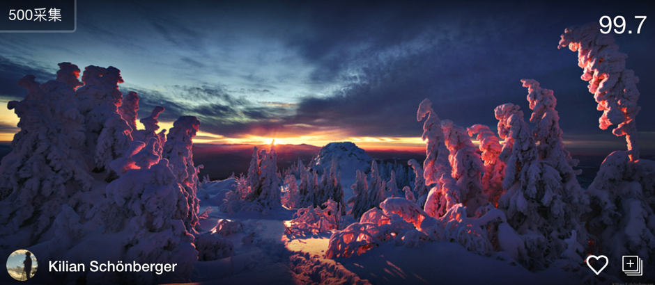

# Image Picker

## Introduce
图片采集chrome extension，方便本地存储或直接上传到七牛等平台

## Feature
* 支持鼠标右键Context Menu
* 支持鼠标hover出现采集按钮
* 支持所有图片列表选择下载(点右上角插件图标)
* 支持[500px](https://500px.com/popular)大图采集

## 使用方法
### 方案一
* 打开chrome输入`chrome://extensions`
* 下载[Image_Picker.crx](./art/Image_Picker.crx)拖入`chrome://extensions`面板
* 此时右上角会出现插件图标，打开想要采集的页面，刷新下就能work了， Enjoy your fun

### 方案二
* `git clone https://github.com/huazhiyuan2008/Image_Picker`
* 打开chrome输入`chrome://extensions`
* 勾选`Developer mode`
* `Load unpacked extension...`选择工程目录
* 此时右上角会出现插件图标，打开想要采集的页面，刷新下就能work了， Enjoy your fun

## 效果
访问[500px](https://500px.com/popular)，鼠标滑到图片上，左上角出现采集图标

## Blog

[Chrome插件之Image Picker实战](./blog.md)

## Ref

[chrome extensions getstarted](https://developer.chrome.com/extensions/getstarted)

[chrome extensions api](https://developer.chrome.com/extensions/api_index)

[Chrome扩展及应用开发](http://www.ituring.com.cn/minibook/950)

[image-picker](https://github.com/bluemirr5/image-picker)

[image-downloader](https://github.com/vdsabev/image-downloader)